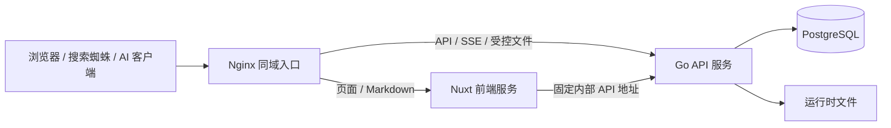

# GoBBS 前后端分离开发方案

创建日期：2026-09-06。状态：后端展示层剥离已实施；Nuxt 前端及完整契约阶段尚未完成。

本文件是后续分离开发的设计基线。目标是保留 Go + PostgreSQL 的业务能力，将页面、交互和面向爬虫的文档输出迁到独立 Nuxt 前端。除下方实施记录明确列出的项目外，本文目录、接口和响应约定仍为目标设计；当前接口以 [API.md](API.md) 为准。


## 0. 实施记录：2026-09-06 后端先行剥离

按本次开发指令，先剥离后端展示内容，调整原先“前端全部接替后再删除模板”的执行顺序。本次仅修改源码并在隔离环境验证，现有线上进程与业务数据未替换。

已实施：

- 删除 `assets/templates`、`assets/static`、Go 模板渲染器、整页缓存、页面/伪静态路由、Flash Cookie 与页面跳转。
- `internal/web` 的业务代码迁入 `internal/api`，保留写入校验/事务调用，新增显式 JSON DTO、公开内容/账号/后台读取接口、session/CSRF 初始化。
- SSE 改发 ID、版本及计数，长连接重新校验会话和资源；读取数据与阅读/通知已读操作拆开。
- 正文和搜索摘要不再由后端生成 HTML；移除 goldmark 依赖。数据库 schema/编号迁移仍被 embed，媒体访问保留权限校验。
- 原 HTML 测试改为 API 行为验证，覆盖身份、业务写入、权限/隐私、审核、文件和纯数据事件；测试使用专用隔离库及临时上传目录。

验证记录：`go vet ./...` 与后端构建通过；`go test -race ./internal/api -count=1` 在隔离库通过 23 项顶层测试（含读取端点子用例），`go test ./internal/store -count=1` 在另一个隔离库通过 23 项测试；其余基础包单测通过。独立新二进制在第三个空测试库完成 schema 5 初始化、安装校验、创建分类/版块、发帖/回复、SSE 纯数据事件、旧页面 JSON 404 和退出撤销的实际 HTTP 验证。测试进程已停止，验证不代表 Nuxt 或生产部署已完成。

本轮边界：Nuxt、SSR 页面、Markdown 文档出口、SEO、OpenAPI 和生成客户端均未完成。部分动作名/写字段保留旧约定，点赞/收藏仍为 toggle，写入幂等未完成；当前 API 是迁移版本，不宣称全部目标契约已实现。`internal/service` 尚未机械拆层，先复用现有业务流程。

**部署与回滚差异**：此版本不含可访问的网站页面，暂不替换生产网站。旧 `content_html` 列保留但新建/编辑不再生成 HTML，因此不能假定旧页面二进制可以直接显示新写入内容；真实发布前须重新设计兼容回滚，或补齐原文到旧 HTML 的恢复流程。下文原迁移计划作为目标保留，不应据此跳过这项实际差异。

### 0.1 后续实现：会员后端

会员等级、成长规则、经验流水、等级权限 / 额度、版块读取限制、等级徽章数据、后台配置预览与人工调整 API 已实现。详细契约与 schema 6 迁移说明见 [MEMBERSHIP.md](MEMBERSHIP.md)。Nuxt 应直接使用 API 返回的 `level`、`authorLevel`、`capabilities`，不复制后端升级或权限规则。会员管理 UI 仍未开发。

任务称号和作者采纳后端已实现，相关迁移为 schema 7。条件、发布补发、佩戴和 API 契约见 [TITLES.md](TITLES.md)。Nuxt 使用 `equippedTitle`、`acceptedPostId`、`accepted` 和采纳 capabilities；称号 UI 待实现。

后续基础流程推进到 schema 8：通知分页/偏好及系统事件、replyTo/viewerHasLiked、楼层位置 API、草稿 subject、本人内容状态 API；接口和前端刷新规则见 [FORUM_WORKFLOWS.md](FORUM_WORKFLOWS.md)。收藏删楼未读和审核回复通知两项缺陷已补修，页面尚待接入。

会员模块直接采用新系统：默认五级经验门槛为 0 / 100 / 500 / 1500 / 5000；不映射旧三级信任等级、不双写旧字段。迁移 006 删除 `users.trust_level`，现有账号首次接入从 LV0 开始。下文通用兼容策略不适用于这项已明确调整的会员设计。

## 1. 已确定的方向与范围

| 项目 | 决策 |
| --- | --- |
| 后端 | 保留 Go、标准库 HTTP 路由和 PostgreSQL；仅负责 API、业务规则、数据、鉴权及事件 |
| 前端 | Nuxt + Vue + TypeScript，公开内容页面使用 SSR；前台与管理后台共用一个前端项目 |
| 部署 | 同一仓库、独立构建发布；Nginx 同域分流到 Go API 和 Nuxt 服务 |
| 搜索引擎 | 默认获得与用户相同的完整 HTML；正文和当前页回复不依赖浏览器执行 JavaScript |
| AI 读取 | 提供独立 Markdown 文档地址及 `Accept: text/markdown` 内容协商 |
| UA | 仅作为可选兼容规则，不作为主要分流依据，也不能改变访问权限 |
| 登录 | 复用随机会话 token + HttpOnly Cookie，继续校验 CSRF；本次不引入 JWT |
| 实时 | 保留 SSE，载荷改为数据变化事件，停止发送 HTML 片段 |
| 数据 | 优先复用表结构和 `store`；先兼容迁移，后清理旧字段 |
| 部署规模 | 保持单实例；分离不解决现有进程内缓存、限流、SSE 和计数的多实例问题 |

本次覆盖当前全部功能，包括安装向导、账号、前台、治理后台和运维入口。第一轮以功能与权限等价为目标，不同时进行大规模视觉改版，不顺带引入微服务、Redis、消息队列、插件系统或新业务功能。

Nuxt/Node 增加一个运行服务，但让 Go 退出页面渲染。现有“一个二进制包含整个网站”的部署形式会在最终切换后改变；Go API 本身仍可单二进制部署。

## 2. 原实现与迁移落点

本表记录方案编写时的原实现；部分文件已删除或移入 `internal/api`，实际进度见第 0 节。

| 当前位置 | 现状 | 目标 |
| --- | --- | --- |
| [cmd/forumd/main.go](../cmd/forumd/main.go) | 连接数据库、迁移、装配业务和 Web 服务 | 保留业务启动逻辑，最终装配 API 服务 |
| [internal/web/routes.go](../internal/api/routes.go) | 混合页面、表单、JSON、静态资源和伪静态路由 | 新增版本化 API；页面 URL 交给 Nuxt |
| `原 internal/web/handler_page.go`（现见 [handler_read.go](../internal/api/handler_read.go)） | 查询、权限、阅读统计、页面组装和渲染混合 | 拆出查询及阅读业务；展示、SEO、分页 UI 移入前端 |
| [internal/web/handler_post.go](../internal/api/handler_post.go) | 校验、事务调用、正文转换、广播及跳转混合 | 业务流程抽出；API 返回结果，前端控制导航与提示 |
| `原 internal/web/render.go`（已删除） | 模板、分页 UI、展示类型中包含部分权限函数 | 展示逻辑删除；权限函数迁到业务/权限边界后再移除文件 |
| [internal/web/handler_live.go](../internal/api/handler_live.go) | SSE 包含 `postHtml`、`threadRow`、`forumRow` | 改为资源 ID、事件类型及可选版本/计数 |
| [internal/web/handler_interact.go](../internal/api/handler_interact.go) | 同时包含互动 API 和整页 HTML 缓存 | 拆开；移除 Go 整页缓存，按需设计数据缓存 |
| [internal/web/handler_notify.go](../internal/api/handler_notify.go) | 上传、附件及其他交互处理 | 文件校验和访问控制留在 Go，不随页面迁移而绕过 |
| [internal/store](../internal/store) | SQL、事务、计数、搜索和缓存 | 大部分复用；按 API 查询和权限需要调整 |
| [internal/perm](../internal/perm) | 固定角色、数据库可调权限矩阵、信任等级 | 继续作为权限规则核心，统一资源范围判定 |
| `原 internal/markdown`（已删除） | Go 生成正文 HTML，编辑预览共用 | 最终由前端共享正文渲染模块替代；迁移期间兼容保留 |
| [assets](../assets) | embed 模板、静态资源、数据库 schema/迁移 | 最终仅保留后端所需资产；不能误删数据库迁移 |
| [cmd/gobbsctl/main.go](../cmd/gobbsctl/main.go) | 单个 Go 二进制升级与健康检查 | 保留后端升级职责，补充前后端成对发布与回滚流程 |

现有功能说明见 [README](../README.md)、[ROADMAP](ROADMAP.md)。[API.md](API.md) 描述当前迁移版本的已实现接口；本文件描述完整目标。后续 `/api/v1` 的准确字段和状态码以新增的 OpenAPI 契约为准。

## 3. 请求与渲染流程



### 3.1 HTML 首次访问

1. 用户或蜘蛛请求帖子 URL，Nginx 将请求交给 Nuxt。
2. Nuxt 在服务器上调用 Go API，获取主题、当前页楼层、附件和必要的站点信息。
3. Nuxt 使用 Vue 页面组件生成完整 HTML，包括正文、分页链接、标题及元信息。
4. 浏览器收到 HTML 后即可展示正文；搜索蜘蛛无需执行 JavaScript 就能读取当前页内容。
5. 浏览器加载 JavaScript 后进行 hydration，为现有 HTML 接上点赞、编辑器、SSE 等交互。
6. 后续站内导航可使用客户端路由及 API；直接访问、刷新、分享同一 URL 时仍能 SSR。

开发要求：首屏数据使用支持 SSR 的 `useFetch` / `useAsyncData` 等机制，不能只放在 `onMounted` 中。SSR 结果传给浏览器复用，避免 hydration 时无意义地重复请求。正文渲染不能依赖仅浏览器存在的对象；编辑器等组件可按需仅在客户端加载。

无 JavaScript 时保证当前页阅读、普通链接及翻页可用；点赞、编辑器、实时更新等交互需要 JavaScript。SSR 不解决 API 不可达、数据库故障或 CSS 下载失败的问题。

### 3.2 页面渲染策略

| 页面 | 策略 |
| --- | --- |
| 首页、版块、帖子、最新回复、公开用户资料、条款及隐私页 | SSR，输出当前页面的实际内容 |
| 搜索结果 | SSR 便于阅读，默认 `noindex`，避免无限筛选 URL 被索引 |
| 登录、注册、找回密码、安装向导 | 前端提供页面，业务调用 Go API，默认 `noindex` |
| 个人设置、草稿、收藏、通知 | 可采用客户端取数；鉴权、`no-store`、`noindex` |
| 管理后台 | 可采用客户端渲染；页面守卫用于体验，Go API 必须独立鉴权 |

页面不存在时返回真实 404，服务不可用时返回对应 5xx；不能一律 200 后在页面中显示错误。关闭站点、尚未安装和强制改密状态由 API 明确表达，Nuxt 决定展示和导航。

### 3.3 写操作

浏览器通过同域 `/api/v1` 直接提交到 Go；Nuxt 不复制业务服务。Go 完成鉴权、CSRF、校验、事务和业务副作用后返回结果；前端更新状态或导航。发帖成功返回主题/楼层 ID、版本及审核状态，不返回 HTML 和跳转页面。

## 4. 代码职责与建议目录

```text
frontend/                 Nuxt 项目（拟新增）
  app/                    页面、组件、布局、composables
  server/                 Markdown 出口、SEO 等前端输出端点
  shared/                 SSR/浏览器共用的正文规则、类型和工具
internal/
  api/                    HTTP 路由、请求/响应 DTO、错误映射、中间件
  service/                需要组合权限、事务、通知的业务流程
  store/                  SQL、事务与持久化一致性
  perm/                   角色、信任等级、资源权限规则
  live/                   订阅及纯数据事件
  config/ db/ mail/ ...    复用现有基础能力
docs/
  openapi.yaml            /api/v1 契约（拟新增）
```

目录以阶段零锁定的 Nuxt 稳定版本为准。依赖和包管理器版本必须锁定，使用可重复安装的锁文件。

Go 保留：权限、参数校验、审核决策、敏感词、密码处理、邮件、文件类型和限额校验、事务、统计、搜索、审计。前端校验只用于即时提示，不能替代 Go 校验。

前端负责：布局、表单、按钮、分页 UI、时间格式、导航、提示、正文展示、SEO 和 Markdown 文档组织。Nuxt 不直连数据库，不持有业务数据库凭据。

`service` 用于真正的业务组合，简单只读查询不必增加无意义的转发层；不为每个表建立一套空接口。消除 HTML 缓存、模板函数和重定向代码，不以增加抽象层数量作为完成标准。

## 5. API 契约基线

### 5.1 通用约定

- 新接口前缀为 `/api/v1`；普通请求/响应使用 JSON，文件上传使用 multipart，SSE 和下载维持各自内容类型。
- JSON 字段使用 camelCase；数据库 bigint ID 一律输出为十进制字符串。版本号、计数及页码在安全范围内使用数字；时间使用带时区的 RFC 3339。
- 单资源成功示例：`{"data":{"id":"123","title":"主题"}}`。
- 列表成功示例：`{"data":[],"meta":{"page":1,"pageSize":20,"total":0,"totalPages":0}}`。零结果的 `totalPages` 为 0；页码从 1 开始；超范围列表返回空数据和准确元数据，前端负责显示或规范化页面 URL。
- 第一版采用页码分页，默认沿用站点设置，单次最多 100 条；更大规模游标分页另行评估。
- 错误示例：`{"error":{"code":"VALIDATION_FAILED","message":"请检查输入","fields":{"title":"不能为空"}},"requestId":"..."}`。错误不能泄露 SQL、连接串或堆栈。
- 正确使用 200/201/204、400/401/403/404/409/413/415/422/429 和 5xx；详情在 OpenAPI 固定。204 不带响应体。
- 状态型操作优先显式设置：点赞、收藏采用 PUT 设置 / DELETE 取消，避免 toggle 在重试时反转结果。
- 发帖、回复等非幂等写入在阶段零确定请求幂等键及存储/有效期策略，阶段三实现；防止网络重试重复发帖，不能只依赖禁用提交按钮。
- 编辑传递当前资源版本，冲突返回 409；前端保留未提交内容，不静默覆盖他人或另一设备的修改。

### 5.2 身份、CSRF 与 SSR 请求隔离

- 沿用现有服务端会话及撤销能力，Cookie 使用 HttpOnly、SameSite，并在 HTTPS 生产环境使用 Secure；退出、改密、封禁后失效规则保持一致。
- 拟用 `GET /api/v1/session` 返回当前会话视图和 CSRF token，游客也可初始化 CSRF；该响应始终 `no-store`。写请求统一使用 `X-CSRF-Token`，覆盖匿名登录、注册、找回、安装和 multipart 上传。
- 登录/退出后的 token 轮换由前端刷新会话处理。Origin/来源检查作为补充，不能单凭 SameSite 省略 CSRF。
- 浏览器使用相对 API 地址。Nuxt 的服务端请求使用配置中的固定内部地址，只转发当前请求需要的会话信息；不能从任意 Host/URL 参数构造上游地址。
- Nuxt SSR 的用户状态必须按请求隔离，不能将 Cookie、用户、CSRF 放进模块级共享变量。hydration payload 只能含当前页面允许公开给该访问者的 DTO。
- SSR 若调用会设置 Cookie 的端点，需要显式、正确地把必要的 `Set-Cookie` 传回浏览器；不要假设内部 fetch 会自动传播。优先让浏览器直接完成登录和 token 初始化。
- API 返回 `SETUP_REQUIRED`、`PASSWORD_CHANGE_REQUIRED`、`SITE_CLOSED` 等稳定状态，禁止以登录页 HTML/302 作为 API 错误响应。需明确安装、改密、关站时允许调用的接口集合。

### 5.3 DTO 和资源可见性

不能直接 JSON 序列化 `store` 模型：例如 `User` 含密码哈希、邮箱，`Post` 含 IP。公开用户、当前用户和管理员视图分别定义字段白名单，前端不负责“拿到后再隐藏”。

资源可返回 `capabilities: {canEdit, canDelete, canModerate}` 供展示，但写操作必须重新校验。角色权限、版主管辖、内容归属、封禁、禁言、待审和删除状态采用同一套业务规则；不能只判断“是不是版主”。详情、列表、搜索、历史、附件、SSE 和 Markdown 读取口径必须一致。

### 5.4 拟定接口与功能覆盖表

以下为分组设计，字段、子操作及枚举在阶段零 OpenAPI 中补齐。每项需同时盘点当前路由，避免迁移遗漏。

| 功能 | 拟定 /api/v1 资源 | 当前实现依据 |
| --- | --- | --- |
| 站点配置、公告、统计、首页聚合 | `GET /site`、`GET /home` | `handler_page.go`、`store/settings.go`、`store/stats.go` |
| 分类、版块、置顶、主题筛选及最新回复 | `GET /forums`、`GET /forums/{id}`、`GET /threads` | `handler_page.go`、`store/forum.go` |
| 主题、楼层、发帖/回复/编辑/删除 | `/threads`、`/threads/{id}/posts`、`/posts/{id}` | `handler_post.go`、`store/write.go` |
| 搜索 | `GET /search` | `handler_page.go`、`store/search.go` |
| 会话、注册、登录、退出 | `/session`、`/auth/register`、`/auth/login`、`/auth/logout` | `handler_user.go` |
| 验证码、找回/重置密码、验证邮箱及重发 | `/auth/captcha`、`/auth/password/*`、`/auth/email/*` | `handler_user.go`、`handler_reset.go`、`handler_static.go` |
| 公开个人资料及主题/回复记录 | `/users/{id}`、`/users/{id}/threads`、`/users/{id}/posts` | `handler_user.go` |
| 个人设置、改密、头像、导出、注销 | `/me`、`/me/password`、`/me/avatar`、`/me/export`、`DELETE /me` | `handler_profile.go` |
| 点赞、点赞名单 | `/posts/{id}/like`、`/posts/{id}/likes` | `handler_interact.go`、`handler_notify.go` |
| 收藏、草稿、编辑历史 | `/me/favorites`、`/threads/{id}/favorite`、`/me/drafts`、`/posts/{id}/history` | `handler_community.go`、`handler_interact.go` |
| 通知及标记已读 | `/me/notifications` 及相应已读操作 | `handler_notify.go`、`store/notify.go` |
| 举报 | `POST /posts/{id}/reports` | `handler_report.go`、`store/report.go` |
| 上传、下载、表情目录、头像/验证码图像 | `/uploads`、`/files/{id}`、`/smileys` 及媒体端点 | `handler_notify.go`、`handler_static.go` |
| 阅读记录 | `PUT /threads/{id}/read` | `handler_page.go`、`store/interact.go` |
| 安装初始化 | `GET /setup`、`POST /setup` | `handler_setup.go`、`store/setup.go` |
| 实时事件 | `GET /events` | `handler_live.go`、`internal/live` |
| 后台仪表盘、分类/版块维护及移动 | `/admin/stats`、`/admin/categories`、`/admin/forums` | `handler_admin.go` |
| 主题置顶/精华/锁定/删除、审核、举报处理 | `/admin/threads`、`/admin/moderation`、`/admin/reports` | `handler_admin.go`、`handler_admin_moderate.go` |
| 回收站恢复/清除、批量删帖 | `/admin/recycle`、`/admin/prune` | `handler_admin_gov.go`、`handler_admin_ops.go` |
| 用户禁言/封禁/解除/改组/删除 | `/admin/users` 及对应动作 | `handler_admin.go`、`handler_setup.go` |
| 站点设置、权限矩阵、敏感词、公告、审计日志 | `/admin/settings`、`/admin/permissions`、`/admin/censor-words`、`/admin/announcements`、`/admin/logs` | `handler_admin*.go`、`handler_setup.go` |
| 健康与就绪状态 | `/health/live`、`/health/ready`；兼容旧 `/api/status` | `handler_static.go`、`gobbsctl` |

允许首页等适度聚合，避免请求瀑布；不把整个网站所有数据塞进一个初始化接口。公共站点 DTO 不包含管理配置、密钥或内部运行信息。

## 6. Markdown、搜索蜘蛛与 SEO

### 6.1 输出规则

| 请求 | 输出 |
| --- | --- |
| 普通页面 URL，默认 Accept 或 `*/*` | SSR HTML，浏览器与搜索蜘蛛正文一致 |
| `/content/threads/{id}.md?page=1` | 明确的公开 Markdown 文档 |
| 支持文档输出的页面，显式优先接受 `text/markdown` | 同一页面范围的 Markdown 文档 |
| 可选 UA 兼容表命中 | 仅在无明确格式偏好时补充分流；默认不启用 |

Accept 解析遵循媒体类型权重；`q=0` 代表拒绝，通配符不能被误判为明确要求 Markdown。仅公共内容路由支持协商，不能把登录、API、后台和附件端点都做格式切换。页面提供可发现的 Markdown 链接；`llms.txt` 可作为补充索引，不假设爬虫必然读取。

Markdown 由 Nuxt 读取 Go 提供的 Markdown 原文和公开 DTO 组织，包含标题、原文规范 URL、作者、发布时间、更新时间、正文、当前页回复、页码与下一页链接。文档按页输出并限制大小，不能把整个大主题无限展开。图片、附件及站内引用使用可信站点地址转换为绝对链接，自定义表情保留可理解的替代文本。

独立 Markdown 出口固定使用游客可见范围，不转发登录 Cookie，不因管理员登录而输出待审内容。它与对应页面的游客视图保持一致；个人和管理数据不提供爬虫文档。格式、robots、UA 都不是授权机制。

### 6.2 正文渲染迁移

目标：Go 保存、校验和审核 Markdown 原文，维护搜索索引；Nuxt SSR、浏览器展示和编辑预览共用一套 Markdown 解析及安全清理规则。Go 不再生成供新版前端使用的正文 HTML。

迁移时先保留 `content_html` 及旧 goldmark 路径，必要时通过旧站兼容逻辑双写，以保证旧版可回滚；新版以原文为准。表情、换行、代码块、引用、链接、图片、附件和历史内容需建立对照样本。前端解析器和 HTML 清理器须支持 SSR，限制危险 URL 协议和原始 HTML；不能将用户原文直接交给 `v-html`。

敏感词、链接识别和审核判断继续在 Go 执行；这些规则不能依赖浏览器。删除 `content_html`、旧预览端点和 Go 渲染包只能在旧站退役且回滚窗口结束后另做迁移。

### 6.3 SEO 与旧 URL

- 首轮保留 `forum-N-P.html`、`thread-N-P-L.html` 的访问兼容与楼层锚点；canonical 规则延续当前规范化行为。以后更换 URL 必须建立对应的永久重定向，不能全部跳首页。
- Nuxt 输出 title、description、canonical、Open Graph、适用的结构化数据及真实分页链接。
- `robots.txt`、`sitemap.xml`、RSS 由 Nuxt 基于公开 API 生成；Go 可提供分页的公开索引数据接口。不能通过 HTML 抓取来拼接目录。
- HTML、Markdown、sitemap 和 RSS 使用相同公开状态和可信站点基址。Markdown 响应通过 `Link` 等方式标识对应的 canonical HTML 页面；分页文档对应其具体页。
- 不给蜘蛛额外堆砌关键词或提供用户无法访问的正文。Markdown 有助于机器读取，不保证收录、训练使用或答案引用。

## 7. SSE、阅读记录与文件

### 7.1 纯数据事件

新事件示例：

```json
{"type":"post.updated","threadId":"123","postId":"456","version":3}
```

事件类型在 OpenAPI 的补充事件 schema 中列明，统一为 `post.created/updated/deleted`、`post.like.changed`、`thread.created/updated/deleted`、`notification.changed` 等；旧事件名由迁移适配层处理。

- 事件不携带 HTML，也不携带全体订阅者不一定有权读取的对象。前端按 ID 重新请求资源，对短时间事件合并刷新；版本仅在资源已有可靠版本机制时使用，不能伪造全局有序版本。
- 删除事件移除本地内容；读取返回 403/404 时清除旧内容。断线重连、页面恢复可见时重新同步当前数据，第一版不承诺持久化事件重放或恰好一次投递。
- 保留心跳、慢消费者处理和限流；Nginx 禁用 SSE 缓冲，配置适当读超时，SSE 不进入整页缓存或普通压缩流程。
- 个人订阅绑定当前会话；资源订阅检查可见性。长连接期间发生退出、封禁、权限变更时，需要定期重新校验或主动断开，不能只在建立连接时检查。
- 旧页面迁移期间可保留旧 SSE 适配器，但业务层仅发布一次变化，禁止因此重复写库、重复通知或重复统计。

### 7.2 阅读与浏览量

当前帖子页读取会增加浏览量、写阅读进度并尝试提升信任等级。拆分后 SSR、浏览器预取、SSE 重新获取都会读取数据，因此 GET 数据接口不直接承担这些副作用。

前端在实际展示后上报阅读位置；Go 验证用户及可见楼层、保证进度单调并做时间窗去重，信任成长规则留在后端。楼层可能因删除存在空洞，不能简单用页码乘页大小代表实际阅读楼层。游客浏览统计单独定义去重策略，Markdown 和纯爬虫抓取不计入用户阅读成长；UA 不作为唯一判定依据。

### 7.3 文件与媒体

Go 保留上传类型嗅探、大小/磁盘限额、所有权、挂楼层、审核可见性和访问控制。受控附件不能简单用 Nginx `alias` 绕过 Go；可在 Go 授权后交给内部文件加速。确定公开的前端资源、头像或表情可单独缓存。

现有 `/uploads/`、`/smiley/`、`/avatar/` 链接需保留或兼容，避免旧正文断图。验证码、附件下载、头像图像可以是 API 返回的媒体，不属于页面渲染；“纯 API”不意味着只能返回 JSON。

## 8. 缓存、安全头与运行边界

第一版关闭 Nuxt 的共享整页缓存，先保证 SSR 与权限正确。静态构建资源可长期缓存，Go 已有数据缓存按业务规则保留。取得性能数据后再逐项启用匿名公共内容缓存，避免首轮就增加跨服务缓存失效系统。

启用内容缓存之前必须满足：

- HTML 和 Markdown 区分缓存键与校验器；协商端点发送正确的 `Content-Type` 和 `Vary: Accept`。若启用 UA 分流，所有代理/CDN 必须能够正确区分结果；不能只设置源站逻辑。
- 登录态、CSRF、草稿、通知、后台及个性化能力不进入共享缓存。出现 Set-Cookie 的响应不能被意外当成匿名公共页面缓存。
- 缓存键覆盖页面、查询条件及表示格式；用户态请求绕过公共缓存。ETag 必须对应具体表示，不能把 HTML 的 ETag 直接复用给 Markdown。
- 发帖、编辑、删除、审核、版块可见性和关站设置变化，有明确且可验证的失效策略。涉及撤回内容不能仅靠长 TTL 或浏览器 SSE 保证删除；失效失败时禁用对应缓存。不得把公开 SSE 当成可靠的后端缓存失效总线。
- SSR 内部 API 和 Cookie 不因 Nuxt 跨请求缓存而串用户；增加双用户隔离验证。

页面安全响应头由 Nuxt/Nginx 负责，Go 保留 API 适用的头。现有 Go 的 CSP 不能原样假设适配 Nuxt：需验证 hydration 脚本、内联 payload 和 nonce/hash 策略，避免依靠全局放开脚本执行解决问题。错误页、Markdown、上传响应也需正确设置内容类型。

## 9. 分阶段任务与验收

每阶段完成后记录实际改动、契约版本、验证命令与结果、已跳过的检查和剩余问题。文档复选框只在对应验收通过后更新。

### 阶段零：契约与工程准备

- [ ] 盘点旧路由与功能，将第 5.4 节扩展为逐接口映射和验收清单。
- [ ] 新建 `docs/openapi.yaml`，锁定请求、DTO、错误、权限、分页、文件及事件契约；生成前端类型的流程可重复执行。
- [ ] 锁定 Nuxt/Node、包管理器、Markdown 解析及安全清理依赖；创建 `frontend/` 工程和开发代理。
- [ ] 固定会话/匿名 CSRF 流程、媒体访问、阅读统计和写入幂等设计。
- [ ] 准备独立开发/测试数据库和上传目录；确认不会连接业务库。

验收：前端能够基于契约 fixture 开发；工程可构建，契约示例通过校验；本阶段不改变生产路由。

### 阶段一：API 基础与公开只读 SSR

- [ ] 实现 API 装配、请求 ID、错误映射、DTO、会话上下文和必要的权限查询。
- [ ] 完成站点、首页、版块、主题、当前页楼层和搜索 API，以及对应 Nuxt 页面。
- [ ] 保持旧 URL、分页、404/5xx 行为；从 GET 读取中拆离阅读副作用。

验收：直接 HTTP 获取包含真实标题、正文和当前页回复；浏览器关闭 JavaScript 后仍可阅读和翻页；游客读不到隐藏内容；Nuxt 不直接访问数据库。

### 阶段二：Markdown 与 SEO 输出

- [ ] 实现 `.md` 地址、Accept 协商、绝对链接、分页和规范 URL。
- [ ] 实现元信息、robots、sitemap、RSS，统一游客可见性。
- [ ] 完成 SSR/浏览器共用的正文渲染及历史内容对照。

验收：默认请求返回 HTML；明确 Markdown 请求返回正确文档；HTML/Markdown 权限一致，Accept 权重与响应头正确，浏览器不会拿到错误格式。UA 规则默认关闭。

### 阶段三：账号与完整发帖闭环

- [ ] 完成注册/验证码/登录/退出、验证邮箱、找回密码、改密及强制改密状态。
- [ ] 完成发帖、回复、编辑、删除、上传、草稿与审核状态反馈。
- [ ] 接通纯数据 SSE、重连同步、阅读上报、请求幂等及编辑冲突处理。

验收：登录 → 发帖 → 上传 → 回复 → 编辑 → 实时刷新闭环通过；重试不重复发帖；待审内容不对游客广播；改密/封禁和版主管辖不退化；CSRF 包含匿名表单场景。

### 阶段四：社区与个人功能补齐

- [ ] 完成资料、头像、公开用户记录、导出和注销。
- [ ] 完成点赞名单、收藏、通知/已读、举报、编辑历史及信任等级展示。

验收：逐项与旧功能映射核对；用户隐私、附件、历史内容和计数口径一致。

### 阶段五：后台与安装向导

- [ ] 完成后台仪表盘、分类/版块、内容管理、用户管理和权限矩阵。
- [ ] 完成审核/举报、回收站、批量清理、敏感词、公告、设置和审计日志。
- [ ] 完成空库安装、并发初始化保护、关站例外和设置即时生效。

验收：管理员、管辖版主、非管辖版主、会员、游客的允许/拒绝矩阵通过；数据库初始化不会生成多个首任管理员；旧治理功能无遗漏。

### 阶段六：发布切换与旧渲染退役

- [ ] 完成前后端构建、配置模板、就绪检查和版本兼容说明。
- [ ] 在隔离环境验证新旧共存、旧链接、文件、性能及故障处理，演练发布和回滚。
- [ ] 切换页面到 Nuxt，保留过渡期 API/媒体兼容；验证 `gobbsctl` 与监控不因健康地址变化失效。
- [ ] 功能全部迁移、稳定观察及回滚窗口结束后，删除 Go 模板、页面处理、HTML SSE、整页缓存与旧静态资源服务；另行清理旧数据库字段。
- [ ] 更新 README、DEPLOY、API 和功能计划，使其描述实际部署方式；不把本方案中的目标直接当成已完成功能发布。

验收：新版页面和后台无 Go HTML 渲染依赖；数据库迁移仍被正确 embed；前后端能够按兼容契约独立构建发布，切换和恢复步骤可复现。

## 10. 验证与发布约束

### 10.1 验证范围

保留有价值的事务、计数、权限、上传和安全回归测试；旧 HTML 页面冒烟逐步替换为 API 契约测试及前端端到端测试，不因移除模板而丢失原测试覆盖的业务规则。

重点场景：游客/作者/管理员/管辖与非管辖版主、封禁/禁言、待审/删除、附件权限、重复提交、并发编辑、统计回补、通知重复、SSE 重连及鉴权撤销、SSR 双用户隔离、无 JS 阅读、错误 HTTP 状态和格式协商。

现有 `internal/store/store_test.go` 与 `internal/api/smoke_test.go` 的 `TestMain` 会 `DROP SCHEMA public CASCADE`。测试前核验目标库和独立上传路径；绝不对业务库运行。两个包共用一个 `FORUM_TEST_DSN` 并行执行还会互相重置，应分别配置或隔离运行。数据库不可达而跳过不能记为集成验证通过。

后续 CI 至少包含 Go 静态检查/单测、隔离数据库集成、OpenAPI 校验及类型生成一致性、前端类型检查/构建、主要端到端流程。依照阶段运行相关检查，不对纯文档变更启动业务数据库测试。

### 10.2 运行与回滚

- 新增 Nuxt/Node 服务和受支持的运行版本；Go 与 Nuxt 端口仅在需要的内部接口监听，Nginx 提供同域 HTTPS 入口。
- `/api/v1/*` 和 SSE 直达 Go；页面、Markdown、前端静态资源到 Nuxt 或其构建资产目录；旧媒体路由显式兼容。
- Go 就绪检查包含数据库可达和所需迁移版本；Nuxt 检查自身运行，并通过端到端探测确认能取得真实公开页面。Go 不可达时不能以空白 200 页面伪装正常。
- 先发布与旧页面兼容的 API，再发布对应前端，最后切换路由。记录前端版本、后端版本、契约版本及数据库迁移版本，不把所有发布能力塞进现有单二进制升级命令。
- 数据库迁移采用先扩展、后收缩；保留旧站所需字段和行为，确保新版写入后旧版仍可读。备份数据库和运行时文件，并保留旧二进制、旧前端产物和代理配置。
- 回滚先恢复兼容的路由和产物；不能认为恢复二进制会自动撤销数据库迁移。涉及不可逆数据变更时，另行制定恢复步骤。
- 现有服务和数据不因编写本方案而修改；后续开发使用隔离环境验证，实际切换作为独立实施步骤。

## 11. 实施时需补齐的具体选择

以下选择在阶段零确定，不影响已确认的 Nuxt + Go 架构：

1. Nuxt/Node 的具体受支持版本、包管理器、组件库与端到端测试工具。
2. Markdown 解析器、安全清理器、自定义表情插件及旧 goldmark 差异处理清单。
3. OpenAPI 的完整 schema、幂等键保存方式和有效期、阅读去重参数。
4. 前后端部署端口、服务名、CI 产物格式和具体回滚窗口。
5. 取得性能数据后是否启用匿名内容缓存；默认第一版关闭共享整页缓存。
6. 是否有实际客户端需要 UA 兼容和 `llms.txt`；默认采用显式文档地址与 Accept 协商。

## 12. 参考资料

以下官方页面于 2026-09-06 通过代理访问核实成功：

- [Google：Dynamic rendering as a workaround](https://developers.google.com/search/docs/crawling-indexing/javascript/dynamic-rendering)：按爬虫动态渲染属于变通方案，推荐 SSR、静态渲染或 hydration；内容相近时一般不视为 cloaking。
- [Google：Spam policies](https://developers.google.com/search/docs/essentials/spam-policies)：爬虫与用户内容差异、内容伪装等政策背景。
- [Cloudflare：Markdown for Agents](https://developers.cloudflare.com/fundamentals/reference/markdown-for-agents/)：`Accept: text/markdown` 与 `Vary: Accept` 的实际应用。此实现不代表所有 AI 客户端都会主动请求 Markdown，也不要求本项目使用 Cloudflare。
